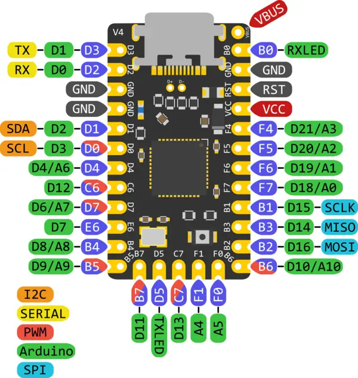
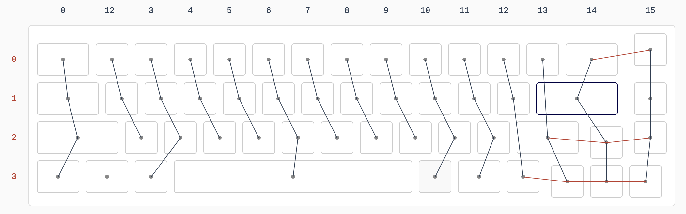

# Balut55
a 55% handwired keyboard with rotary encoder
for an easier transition to a keyboard without numkeys, but still has arrow keys

## Hardware
Microcontroller: Elite-C

### Elite-C Pinout

### Wiring
Wire mapping created using [Keyboard Firmware Builder](https://kbfirmware.com/).
See `vial-qmk > config.h` and `vial-qmk > info.json` for pin configuration.

### Plate
Plate design created using [Keyboard Plate Generator by Keebio](https://plate.keeb.io/)

## Firmware
This keyboard has been programmed to work with [vial-qmk](https://github.com/vial-kb/vial-qmk). Note that the vial-qmk directory will not work on its own. You will need to fork the vial-qmk respository, and nest the directory under vial-qmk > keyboards > handwired

See the [build environment setup](https://docs.qmk.fm/#/getting_started_build_tools) and the [make instructions](https://docs.qmk.fm/#/getting_started_make_guide) for more information. Brand new to QMK? Start with our [Complete Newbs Guide](https://docs.qmk.fm/#/newbs).